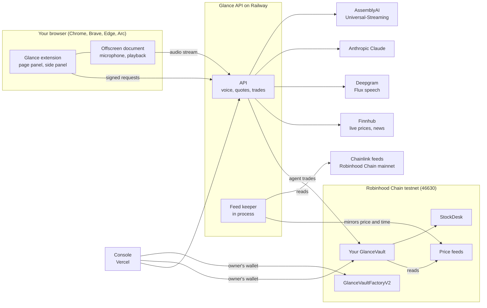

# Glance

**Talk to the stocks you read about.**

Glance is a voice agent in your browser. It reads the page with you, draws on the page and on its charts while it
explains, and buys tokenized stocks on Robinhood Chain from a vault that only you control. Every limit it works within
is enforced by that vault's contract, not by Glance.

Security: see [SECURITY.md](SECURITY.md) and the full audit in [docs/audit.md](docs/audit.md).

## Links

- Website: https://glance-evm-console.vercel.app
- Console: https://glance-evm-console.vercel.app/dashboard
- Install the extension: https://glance-evm-console.vercel.app/install
- Demo video: https://www.youtube.com/watch?v=5sbJWA8093w
- API health: https://api-production-adb0.up.railway.app/health

## What it does

- **Reads.** Tap Option+G on any article and Glance underlines the companies it knows. Hover one for its price, a
  small chart and a buy button.
- **Speaks.** Hold Option+V and ask ("what's Tesla at?", "compare Tesla and AMD this week", "how am I doing?"). Glance
  answers out loud, in one voice, starting as soon as its first sentence is ready.
- **Shows.** Ask about the page and Glance points at what it's talking about as it speaks. Ask about a chart on another
  site ("explain this chart", "where did it bounce?", "show me support") and it marks that chart itself: levels,
  trend lines, circles and shaded zones, on the page's own chart, which stays visible underneath. Glance finds the
  chart's scale by tracing its canvas and fitting it to the market's candles, else from its axis labels, else by
  having a vision model read the axes; if none lines up, it draws nothing and asks before showing its own chart. It
  works for any US stock's chart (NVIDIA, Apple...), from Yahoo Finance's market prices; trading stays limited to
  your vault's approved stocks.
- **Buys and sells.** "Buy ten dollars of Palantir" opens a confirm card with the market price and the price the vault
  will trade at. One tap sends it through your vault, which checks every limit on chain. Selling works the same way,
  by voice or typed: "sell ten dollars of Tesla", "sell half my Tesla", "sell all my Palantir". The card shows the USDG
  you get back, and the USDG lands in your vault.
- **Baskets.** Name a group of stocks ("my tech basket") and buy it in one command; each leg is its own vault trade.
  Baskets are sold one stock at a time.
- **Live prices, with a drift guard.** Market prices come from Finnhub every 15 seconds while the market is open, for
  display. The vault trades on its own oracle price, and Glance refuses to send a trade while the two are more than 2%
  apart.

## Voice, built on AssemblyAI

Speech recognition is AssemblyAI's **Universal-Streaming v3** with the **universal-3-5-pro** model, the one AssemblyAI
recommends for streaming and rates best on entity accuracy (tickers and company names are entities).

- **Keyterms.** Each session sends up to 100 keyterms: every stock and ETF Glance trades, by ticker and name (TSLA and
  Tesla, SPY and the S&P 500 ETF, QQQ and the Nasdaq-100), Glance's own words (Glance, basket, portfolio, vault, USDG), the
  command verbs (buy, compare, chart) and your own basket names.
- **Turns.** Hold-to-talk on Option+V is the default: let go and Glance ends the turn at once (ForceEndpoint), without
  waiting for silence. Conversation mode (a setting) lets you tap once and just talk: AssemblyAI's end-of-turn
  detection sends what you said, and listening stops after the reply.
- **Escape is a hard stop.** It drops the turn: nothing is transcribed further, sent, bought or said.

How it's wired:

- **The key stays on the server.** The extension records in its own offscreen document and streams raw 16 kHz audio
  to the Glance API, which streams it on to AssemblyAI. No AssemblyAI key or token ever reaches the browser.
- **A warm session.** Opening an AssemblyAI session takes about 1.4 seconds from our server, so the API opens one when
  the panel opens (held for 5 seconds, one per browser) and the next command takes it over.
- **Caps.** AssemblyAI's streaming seconds are capped per day (3,600 by default), inside an overall daily cap on speech
  recognition and speech. Past the cap, voice rests for the day and typing still works.
- **Fallback.** If AssemblyAI can't be reached, refuses the session or doesn't open in time, Deepgram listens instead.
  If a turn comes back empty while the audio had speech in it, that audio goes to Deepgram's upload path once.
- **Never silent.** Nothing heard after a real hold: "Didn't catch that, hold ⌥V and try again", shown and said. If
  every speech voice fails: "I've put the answer on screen." Both are pre-recorded.

### A small benchmark: AssemblyAI and Deepgram

Five commands, five runs each, streamed through the Glance API exactly as the extension does it. Medians.

| Command | AssemblyAI: release to text | AssemblyAI: release to audio | AssemblyAI: understood | Deepgram: release to text | Deepgram: release to audio | Deepgram: understood |
|---|---|---|---|---|---|---|
| "What's Tesla at?" | 212 ms | 727 ms | 5/5 | 184 ms | 786 ms | 5/5 |
| "Buy ten dollars of Palantir." | 274 ms | 899 ms | **5/5** | 222 ms | 2,607 ms | **2/5** |
| "How am I doing?" | 222 ms | 229 ms | 5/5 | 526 ms | 532 ms | 5/5 |
| "Compare Tesla and AMD this week." | 243 ms | 865 ms | 5/5 | 478 ms | 1,084 ms | 5/5 |
| "Buy twenty dollars of the ETFs basket." | 328 ms | (no spoken reply) | 5/5 | 345 ms | (no spoken reply) | 5/5 |
| **Total understood** | | | **25/25** | | | **22/25** |

"Understood" means the intent, ticker and amount came out right. On the Palantir command Deepgram heard "Buy $10 of"
three times out of five. Release to audio runs from letting go of the key to the first byte of the spoken reply.

Method, plainly: the audio was recorded with macOS text-to-speech (one voice), streamed in real time from one machine
to a local API, with an AssemblyAI session opened two seconds before each key press (as when the panel is open). It is
a small test of 50 runs, not a general accuracy claim. The script is `apps/api/scripts/stt-compare.ts`.

### Understanding and speech

- **Claude Haiku** (`claude-haiku-4-5`) turns the words into an intent, which is then checked against the catalog and
  against what was actually said. For charts, the numbers (highs, lows, the biggest drop, comparisons) are computed in
  code; Claude only narrates them, and a sentence whose numbers don't match the computed facts is dropped before it's
  shown or spoken.
- **Deepgram Flux** speaks the replies in the **Sienna** voice, streamed from the first sentence. If Flux fails, it's
  tried once more on a fresh connection, then Aura Harmonia takes over; common lines are pre-recorded.

## Architecture



The extension is where you read, talk and confirm. Its offscreen document owns the microphone and plays the replies,
so voice works on any page. The Glance API on Railway does the rest: it streams your audio to AssemblyAI, asks Claude
what you meant, speaks through Deepgram, polls Finnhub for live prices, and sends trades from the agent key to your
vault, which checks every limit itself. The same process runs the feed keeper, which copies the Chainlink feeds on
Robinhood Chain mainnet onto their testnet stand-ins. The console on Vercel is where you, the vault's owner, create the
vault, set its limits and link this browser, always from your own wallet.

## Security model

- **This browser gets a session key.** The extension makes a key once per browser and keeps it there. Your vault's
  owner links it with one EIP-712 signature in the console (a signature, not a transaction), for up to 30 days.
- **Every trade request is signed.** Each one carries an EIP-712 signature by that session key over the exact request
  and its body, a deadline under a minute away and a one-time nonce. A changed byte, a replay or an unlinked browser is
  refused before the agent signs anything.
- **The agent key can only trade.** The API holds it and it's assumed stealable. It can buy and sell approved tokens
  through approved venues, within the vault's rules, and nothing else.
- **The vault's rules**, checked on chain on every trade: a cap per trade and rolling 24-hour caps on buys and on
  sells; an allowlist of tokens and venues; a fresh Chainlink price; at most 1% slippage from that price (the owner's
  setting); an agent that expires (30 days at most); and a pause switch only the owner can use.

**The honest worst case.** Say someone steals the API server and the agent key.

They cannot:

- withdraw anything, or send money anywhere but back into the vault;
- trade a token or through a venue the vault hasn't approved;
- go over the per-trade or daily caps;
- trade on a price older than the vault allows, or at worse than the slippage limit;
- trade after the owner pauses the vault or revokes the agent, or after the agent's permission expires;
- change a limit, approve anything or extend their own permission.

They can:

- make trades you didn't want, inside those caps, at the oracle price within the slippage limit, and every trade's
  proceeds land in your vault.

On this testnet there is one more thing to know: the stand-in price feeds are written by the keeper key, which runs on
the same server. Someone holding it could write wrong prices to the testnet feeds. On mainnet the vault would read
Chainlink's own feeds, which no Glance key can write.

**The weekend guard.** The vault reads each token's price age. A fresh price means the market is open; an older one
means it's closed, and the vault trades more carefully:

| | Market open | Market closed | Price too old |
|---|---|---|---|
| Per trade | $100 | $25 | refused |
| Buys in 24 hours | $500 | $125 | refused |
| Sells in 24 hours | $500 | $125 | refused |
| Slippage | 1% | 0.5% | refused |
| Price age | up to 20 hours | up to 96 hours | over 96 hours |

These are the default limits; the owner can change any of them in the console. Closed-market caps are 25% of the open
ones.

**The drift guard.** Before the API sends any trade or basket leg, it compares the live market price with the vault's
oracle price. More than 2% apart and it refuses: "The on-chain price is behind the market right now, so I won't trade
Tesla yet." This is the API's own check, on top of the vault's.

More in [docs/SECURITY.md](docs/SECURITY.md).

## Context

In May 2026 Robinhood opened [Agentic Trading](https://robinhood.com/us/en/newsroom/robinhood-is-now-open-to-agents/):
customers can connect an agent of their own to their brokerage account through Robinhood's MCP server, trading from a
separate account set aside for it. Glance is an independent project working on the onchain side of the same idea: an
agent that trades tokenized stocks from a vault, with its limits enforced by the vault's contract. It is not affiliated
with, or endorsed by, Robinhood.

## Live on Robinhood Chain testnet (chain 46630)

Every address is in [deployments/46630.json](deployments/46630.json); each links to the
[explorer](https://explorer.testnet.chain.robinhood.com).

| Contract | Address | What it is |
|---|---|---|
| GlanceVaultFactoryV2 | [0xA76C3E2fe629889D8Bc83b285394eC62673B02E4](https://explorer.testnet.chain.robinhood.com/address/0xA76C3E2fe629889D8Bc83b285394eC62673B02E4) | creates a vault, configured and funded, in one transaction |
| GlanceVaultFactory | [0x2dE74C4643FF724c54150f1F24f4d8B73F432999](https://explorer.testnet.chain.robinhood.com/address/0x2dE74C4643FF724c54150f1F24f4d8B73F432999) | the original factory (configure step by step) |
| StockDesk (Paxos USDG) | [0xBe32F06E626e8cEE97cC5368Fb5e76FAaC1289c0](https://explorer.testnet.chain.robinhood.com/address/0xBe32F06E626e8cEE97cC5368Fb5e76FAaC1289c0) | Glance's oracle-priced desk, quoting real Paxos USDG |
| StockDesk (TestUSDG) | [0x78090980265fc28D92A3a2f7bBA7a956b1257619](https://explorer.testnet.chain.robinhood.com/address/0x78090980265fc28D92A3a2f7bBA7a956b1257619) | the same desk for the TestUSDG fallback |
| Paxos USDG | [0x7E955252E15c84f5768B83c41a71F9eba181802F](https://explorer.testnet.chain.robinhood.com/address/0x7E955252E15c84f5768B83c41a71F9eba181802F) | real Paxos USDG on the testnet |
| TestUSDG | [0x231504A1abC63BefC7FFa9930EB085b448b3375E](https://explorer.testnet.chain.robinhood.com/address/0x231504A1abC63BefC7FFa9930EB085b448b3375E) | Glance's fallback stablecoin, with its own faucet |

| Asset | Token | Price feed | Feed source |
|---|---|---|---|
| TSLA | [0xC9f9c869…3Bd4E](https://explorer.testnet.chain.robinhood.com/address/0xC9f9c86933092BbbfFF3CCb4b105A4A94bf3Bd4E) (Robinhood testnet token) | [0xb856AB85…E9e9f](https://explorer.testnet.chain.robinhood.com/address/0xb856AB851b58B3d0436d62b465A9e92c481E9e9f) | mirrors Chainlink on mainnet |
| AMZN | [0x5884aD2f…C9E02](https://explorer.testnet.chain.robinhood.com/address/0x5884aD2f920c162CFBbACc88C9C51AA75eC09E02) (Robinhood testnet token) | [0x8268743C…1015F](https://explorer.testnet.chain.robinhood.com/address/0x8268743C4392Fbc3F9ac06844f8E69431671015F) | mirrors Chainlink on mainnet |
| PLTR | [0x1FBE1a0e…298d0](https://explorer.testnet.chain.robinhood.com/address/0x1FBE1a0e43594b3455993B5dE5Fd0A7A266298d0) (Robinhood testnet token) | [0xAada5690…d9B90](https://explorer.testnet.chain.robinhood.com/address/0xAada5690e1E185731feA3646A723C91497dd9B90) | mirrors Chainlink on mainnet |
| NFLX | [0x3b8262A6…68C93](https://explorer.testnet.chain.robinhood.com/address/0x3b8262A63d25f0477c4DDE23F83cfe22Cb768C93) (Robinhood testnet token) | [0x8B02279a…Ac8a5](https://explorer.testnet.chain.robinhood.com/address/0x8B02279a7844698bD20119DF60A2a55981eAc8a5) | follows a public quote (no Chainlink feed) |
| AMD | [0x71178BAc…9778d](https://explorer.testnet.chain.robinhood.com/address/0x71178BAc73cBeb415514eB542a8995b82669778d) (Robinhood testnet token) | [0xCA26F4a3…E1E476](https://explorer.testnet.chain.robinhood.com/address/0xCA26F4a31e308081c4293F6bBA833c7c8DE1E476) | mirrors Chainlink on mainnet |
| SPY | [0x5d7bEAe6…59c02](https://explorer.testnet.chain.robinhood.com/address/0x5d7bEAe66da99B88Aa1ACE7C49F72e5AFBd59c02) (Glance testnet stand-in) | [0xd30ecC98…5f31](https://explorer.testnet.chain.robinhood.com/address/0xd30ecC9836d4Fa8f27e1Fb037Ee8FF2535dc5f31) | mirrors Chainlink on mainnet |
| QQQ | [0x1f2676a6…6350c](https://explorer.testnet.chain.robinhood.com/address/0x1f2676a6f87c516e48f32DD73bE44E910E66350c) (Glance testnet stand-in) | [0x8831c6e2…D5413](https://explorer.testnet.chain.robinhood.com/address/0x8831c6e248C95168F165eAA7C70173A3f1bd5413) | mirrors Chainlink on mainnet |

**Tests**, from a fresh run:

| Package | Tests |
|---|---|
| Contracts (Foundry) | 175 passed: 163 unit, integration and invariant tests, and 12 fork tests |
| API | 560 passed (13 live provider tests skip unless asked for) |
| Extension | 426 passed |
| Console | 189 passed |
| Keeper | 36 passed |
| End to end (Playwright, the built extension in Chromium) | the install-to-first-buy journey passes |

## Honest notes

- **Testnet only.** Nothing here touches real money.
- **The price feeds are Glance's stand-ins.** Robinhood Chain testnet has no Chainlink stock feeds, so each feed
  mirrors the live Chainlink feed on Robinhood Chain mainnet, both its price and its own timestamp, never "now". It is
  fresh exactly when the real feed is. NFLX has no Chainlink feed on Robinhood Chain, so its stand-in follows a public
  quote instead, and says so.
- **SPY and QQQ are Glance's testnet stand-in tokens**, labelled as such; the five stock tokens are the real Robinhood
  testnet tokens. The desk is Glance's own oracle-priced desk, not an AMM.
- **Live prices are for display.** Finnhub's prices are shown next to the vault's; the vault only ever trades on its
  oracle.
- **Chromium browsers only:** Chrome, Brave, Edge and Arc. Arc has no side panel, so Glance stays a floating panel
  there. Firefox and Safari aren't supported.
- **Not in the Chrome Web Store yet.** You install it from a zip (below).

## Install

Follow the steps on the [install page](https://glance-evm-console.vercel.app/install). In short: download the zip, unzip it, open your browser's
extensions page, turn on Developer mode, choose Load unpacked, and pick the folder. The extension's ID should be
`gmcdcaoneeohbacbnafjdnkkoojgnogl`. Then press **Set me up** in Glance's panel: the console connects your wallet and
creates your vault.

## Run locally

You need Node 22 or later, pnpm 10, and [Foundry](https://getfoundry.sh) for the contracts.

```sh
pnpm install
forge install
```

Each app reads its own `.env` (copy its `.env.example`). Names only; the values are yours:

| Where | Variable | What it is |
|---|---|---|
| `apps/api` | `AGENT_PRIVATE_KEY` | the agent key that signs trades (testnet only) |
| `apps/api` | `RPC_URL` | the Robinhood Chain testnet RPC (the public one by default) |
| `apps/api` | `ANTHROPIC_API_KEY` | Claude |
| `apps/api` | `ASSEMBLYAI_API_KEY` | speech recognition |
| `apps/api` | `DEEPGRAM_API_KEY` | speech, and the speech-recognition fallback |
| `apps/api` | `FINNHUB_API_KEY` | live prices and news (Yahoo is used without it) |
| `apps/api` | `CORS_ORIGINS` | the extension's origin and the console's URL |
| `apps/api` | `KEEPER_IN_PROCESS`, `KEEPER_PRIVATE_KEY` | run the feed keeper inside the API, with the key that owns the testnet feeds |
| `apps/keeper` | `KEEPER_PRIVATE_KEY`, `TESTNET_RPC_URL`, `MAINNET_RPC_URL` | the keeper on its own |
| `apps/console` | `NEXT_PUBLIC_GLANCE_API_URL` | the API the console reads |
| `apps/console` | `NEXT_PUBLIC_WALLETCONNECT_PROJECT_ID` | WalletConnect for mobile wallets |
| `apps/console` | `NEXT_PUBLIC_DEMO_VIDEO_URL` | optional: a YouTube or Loom link embedded on the landing page |
| repo root | `PRIVATE_KEY` | your testnet wallet, for deploying and `make create-vault` |

```sh
pnpm --filter api dev           # the API on http://localhost:8790
pnpm --filter console dev       # the site on http://localhost:3000 (the console at /dashboard)
pnpm --filter extension build   # then load apps/extension/.output/chrome-mv3 unpacked
make keeper-watch               # the feed keeper on its own, if the API isn't running it

pnpm -r test                    # every package's tests
make test                       # the contracts' tests
pnpm --filter extension e2e     # the end-to-end journey in Chromium
```

Deploying: [docs/DEPLOY.md](docs/DEPLOY.md). Every chain address, how it was verified, and what is real versus
stand-in: [docs/CHAIN_NOTES.md](docs/CHAIN_NOTES.md).

## Roadmap

- An audit of the vault, and a multisig for the keys Glance holds.
- A public extension release in the Chrome Web Store.
- Mainnet: the real Stock Tokens and ETFs, priced by Chainlink's own feeds.
- A yield on idle USDG in the vault.
- Connecting to broker agent accounts.
- Mobile.

## Credits

- Glance's "Show me" (speaking while pointing at the page) is inspired by [Clicky](https://github.com/farzaa/clicky)
  by Farza. No Clicky code is used; see [NOTICE](NOTICE).
- Built on Robinhood Chain, Paxos USDG, Chainlink, AssemblyAI, Anthropic Claude, Deepgram and Finnhub.
- Glance began as a Solana project; this is the EVM rebuild.
- Welcome copy adapted from GLANCE by Heylana.

## Team

Minos ([@shroomsgotsol](https://x.com/shroomsgotsol), [github.com/shrooms08](https://github.com/shrooms08)).

## License

[MIT](LICENSE). Third-party notices are in [NOTICE](NOTICE).
